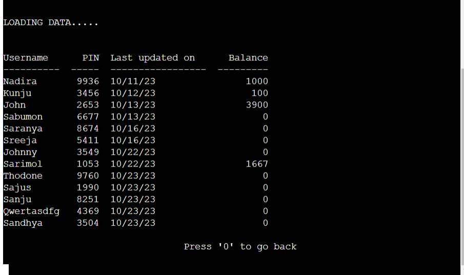

# PEOPLES BANK
Peoples Bank is a python based online banking application which allows the user to create an account, login to the account, deposit money, withdraw money, check their account balance, change their PIN number and delete their account if needed.
This application also allows the admins to login, view all the users having account, view te account details of any particular person and to delete any particular account.

* [Live site](https://peoples-bank-2e284f64d1c0.herokuapp.com/)

 

## Contents
---
* [**Project**](#project)
    * [User Stories](#user-stories)
        * [First Time Users](#first-time-user)
        * [Return Users](#return-users)
    * [Site Owner Goals](#site-owner-goals)
* [**User Experience**](<#user-experience-ux>)
    * [Site Structure](<#site-structure>)
    * [Flow chart](#flow-chart)
    * [Data Model](<#data-model>)

* [**Features**](#features)
    * [Existing Features](<#existing-features>)
        * [Login](<#login>)
        * [Create a new Account](<#create-a-new-account>)
        * [Account Home Page](<#1.-account-home-page>)
        * [Deposit Amount](<#deposit-amount>)
        * [Check your Account Balance](<#check-your-balance>)
        
        * [Withdraw Amount](<#withdraw-amount>)
        * [Know your PIN](<#know-your-pin>)
        * [Change your PIN](<#change-your-pin>)
        * [Your recent Transactions](<#your-recent-transactions>)
        * [Delete your Account](<#delete-your-account>)
        * [Logout](<#log-out>)
        * [Admin Home Page](<#admin-home-page>)
        * [Admin: View all account holders](<#admin-view-all-account-holders>)
        * [Admin: Delete an Account](<#admin-delete-an-account>)
        * [Admin: Check account of a user](<#admin-check-account-of-a-user>)
        * [Admin: Log out](<#admin-log-out>)        
    
* [**Technologies Used**](<#technologies-used>)
    * [Languages](<#languages-used>)
    * [Libraries](<#libraries-used>)
    * [Resources](<#resources>)
* [**Testing**](<#testing>)
    * [Bugs](<#bugs>)
        * [Solved Bugs](<#solved-bugs>)
        * [Unsolved Bugs](<#unsolved-bugs>)
    * [Validator Testing](<#validator-testing>)
    * [Peer Testing](<#peer-testing>)
* [**Deployment**](<#deployment>)
    * [Heroku Deployment](<#heroku-deployment>)
    * [To Fork the Project](<#to-fork-the-project>)
    * [To Clone the Project](<#to-clone-the-project>)
* [**Credits**](<#credits>)
    * [Content](<#content>)
    * [Technical](<#technical>)
* [**Acknowledgements**](<#acknowledgements>)

## Project
---
### User Stories
#### First Time User
A first time user can :
- Create an account
- Deposit some amount
- Know their PIN 
- Log out.

#### Return Users
A return user can :
- Login to Account
- Check their Balance
- Change their PIN
- Withdraw amount
- See their recent transactions
- Close their account

#### Site owner goals
As the site owner you may want:
- To access the Admin's page 
- See the login details of all the users
- See the account details of each user
- Delete any account

[Back to top](<#contents>)

### User Experience (UX)

#### Site Structure
The site displays a welcome page at the beginning which displays two options:
- Login
- Create a new account

After logging in the user is taken to the account home page where the following panel is displayed:

- Deposit Amount 
- Check your Account Balance
- Withdraw Amount
- Know your PIN
- Change your PIN
- Delete  your Account

If an admin enters the website the following panel is displayed:

- View all account holders
- Delete an account
- Check account of a user
- Log out

#### Flow chart
This website has to major utilities which are explained using the two flowcharts below:

Flow chart for users:

Flow chart for Admin:

#### Data Model
Google sheets were used to store and access user data.There are two types of google sheets:
 
 - for all users details
 - for each user

 The sheet with all users details contains:

 - Name
 - PIN
 - Last updation date
 - Balance

 The sheet for individual user contains:

 - Date
 - Deposit
 - Withdraw
 - Balance
 - PIN status

 [Back to top](<#contents>)

 #### Design

* Logo

The bank's logo is displayed on each page and ascii atr generator was used for this.

* Tables

The tabulate module was used to display information in tables.The following are displayed in tables:
    
  - Admin views all users
  - Admin view any users full account
  - User views recent transactions

  ### FEATURES
  #### Existing Features
On entering into the website the bank's logo is displayed and the user is given two options.

1. Login
2. Create a new account

#### Create a new account

If the user is a first time user, he has to create an account by selecting a username.The username is unique for each user and appropriate error message is displayed on entering :

- already existing username
- if it begins with a number
- if it contains space
- characters less than 4 and more than 10

After validating the username, the PIN is automatically generated and a worksheet entiteled to username is generated populated with:

- Date 
- Deposit
- Withdraw
- Balance
- PIN status.
The username and PIN is displayed on the screen.

#### Login

All the users have to login to their account, to attain the services.

To login, the username and PIN is asked and both are cross checked.

If they are found correct, the user is taken to the home page of their account.

#### 1. Account Home Page

The home page contains the following options:
    
0: Log out

1:Deposit Amount

2:Check your Balance

3:Withdraw amount

4:Know your PIN

5:Change your PIN

6:Your recent transactions

7:Delete your account

#### Deposit Amount
---

The user can deposit amount into their account here. They will be asked the amount they want to deposit and a confirmation message will be displayed after depositing the amount sucessfully. Then the user returns to home page automatically.

An appropriate error message will be displayed, if the user enters:

- Negative numbers
- Number Zero
- Any value other than numbers

If the user enters float values of more than two decimal numbers, it will be rounded to two digits before entering the database.

#### Check your Balance
---

The user can check their account balance here. The current balance will be displayed and then they will be taken back to the home page.

#### Withdraw Amount
---
The user can withdraw thier funds from their account as per need.They will be prompted about the amount the want to withdraw. The input is validated and a appropriate error message is displayed if:

- The value is non-numeric
- Negative value
- Zero value
- Greater than their account balance

#### Know your PIN
---
If the user wants to know their PIN ,they can check it here,as it is needed to delete their account.

#### Change Your PIN
---
If the user finds it difficult to remember his PIN,he can change his PIN here.

He will be given two options here:

1. Enter a PIN of your choice
2. Get a new PIN

The user can either select a PIN of his choice or can generate a new PIN number as per his comfort.
A confirmation message will be displayed after the PIN has been changed and the user will be taken back to the home page.

The new PIN will be updated in the Worksheet with the details of clients and in the PIN status column in user's individual worksheet will be updated with 'PIN changed'.

#### Your recent Transactions
---
The user can check their recent transactions here.
The last ten transactions with the particular date will be displayed in table format.

#### Delete your account
---
The user can delete his account, but as it cannot be reversed the user has to confirm it by typing 'y' followed by PIN. 

If he types 'n', he will be taken back to the home page, else a message will be displayed saying their account has been sucessfully deleted.

#### Log out
---

The user can log out from the home page by clicking '0'. To keep them safe, a 'Logging out' message will be displayed and they will be taken to the Login page.

#### Admin Home page
---
This website also provides access to admin.The admin can view all account holders username, PIN, last updation date and Current Balance. This is accessible from the login page by entering 'admin' as username and '9053' as PIN.once the admin logs in a menu is displayed with the fillowing content:

* View all account holders
* Delete an account
* Check account of a user
* Log out

#### Admin View All Account Holders
---
The Admin can view  a list of all account holders in a tabulated form with username, PIN, last updated date and Balance

#### Admin Delete an Account
---
The admin can delete any user's account. To delete the account ,admin has to enter the username and he will be prompted again 'Are you sure the account should be deleted?'.If 'y' is enterd the account will be deleted otherwise it will go back to the home page.

#### Admin Check Account of a User
---
The admin can check any user's account by entering their username.After entering the username the entire account transaction will be displayed in tabuar form. It includes each transaction with respective date and changes in PIN.

#### Admin Log out
---
The admin can safely Log out by selecting the respective option in the menu.

[Back to top](<#contents>)

## Technologies Used
---
#### Languages used
- Python is used for the full funtionality of the website.

#### Libraries used
---

- [gspread](https://docs.gspread.org/en/v3.7.0/api.html) to link up the Google Sheet.
- [credentials](https://pypi.org/project/credentials/) to link the Google Sheet.
- [random](https://docs.python.org/3/library/random.html) to generate a 4 digit random PIN.
- [os](https://www.geeksforgeeks.org/clear-screen-python/) to clear the terminal.
- [datetime](https://docs.python.org/3/library/datetime.html) to get current date
- [time](https://www.programiz.com/python-programming/time/sleep) for the sleep function.
- [Tabulate](https://pypi.org/project/tabulate/) to put data in a table
- [TAAG](https://patorjk.com/software/taag/#p=display&f=Graffiti&t=Type%20Something%20) for the logo.

#### Resources
---

- [Github](<https://github.com/>) to store the code.
- [Heroku](<https://heroku.com/>)
- [Codeanywhere](<https://app.codeanywhere.com/) to write the code.
- [Am I Responsive?](<https://ui.dev/amiresponsive>) for the display image across devices.
- [Stack Overflow](<https://stackoverflow.com/>) for general troubleshooting.
- [W3 Schools](<https://www.w3schools.com/>) for general troubleshooting.
- [MDN Web Docs](<https://developer.mozilla.org/en-US/>) for general troubleshooting.
- [Google Sheets](<https://www.google.co.uk/sheets/about/>) for the spreadsheet used to store the customer data.

[Back to top](<#contents>)

## Testing
---
### Bugs
#### Solved bugs

- A user could enter empty spaces as username, I needed enter one more validation to correct it.
- In withdraw amount() the user could enter a non numeric value, later I added an isalpha() as condition to clear it.
- Repetition of username was possible which lead to multiple sheet with same username. It was removed but adding a condition that makes sure that same username is not present in the database.
- In withdraw amount() negative value and zero was possible to be entered.Later it was removed by adding two if conditions.
- Deposit amount() could also take negative numbers and zero value, It was removed by passing if conditions.
- Deposit amount() had an answer loop wchich did not display the question but only the input area. It was correted by altering the loop.
- Initially account welcome page() had no way to exit and go back to login page. A condition with '0 to log out' was added to correct it.
- The recent transaction() was displaying the first 10 transactions initialy. Added [-10:] to slice the last 10 values.
- Exiting from recent transaction was not possible which was corrected by adding a condition with 'Enter 0 to exit' condition.
- Float values could not be entered in deposit amount() and withdraw amount().It was corrected by adding turn to currency() which converts the amount to float value with two decimal digits.

#### Unsolved bugs
- No known Bugs

[Back to top](<#contents>)

### Validator Testing

- No errors were found by PEP8 validator
- There were only notifications regarding lines too long.As these won't affect the terminal view I decided to leave it to make the code easier to understand.

[Python Validator](https://extendsclass.com/python-tester.html)

- No errors found in python validator.

### Peer Testing

Apart from myself, this program was tested by the following users for bugs and usability
- Rahul Mulakkal
- Ramsankar Adampurath

All of them passed all the tested without any bugs.The following tests were carried out:

| Function                    | Test                                           | Result |
|-----------------------------|------------------------------------------------|--------|
|welcome | Enter incorrect value| Error message displayed and asks again to enter value|
|   | Enter value '1' | The user is asked to enter  their username|
|   | Enter value '2' | The user is asked to select a username |
|   |   |   |
| Login :  Enter Username | Enter invalid username or PIN | Error message displayed and asks again to enter username and PIN |
|   | Enter invalid username and PIN | Error message displayed and asks again to enter username and PIN |
|   | Enter incorrect username and correct PIN | Error message displayed and asks again to enter username and PIN |
|   | Enter correct username and incorrect PIN | Error message displayed and asks again to enter username and PIN |
|   | Enter correct username and PIN | Loading account... is displayed and the user is taken to account's home page |
|   |   |   |
| Account Home page |Entered an invalid input (alphabets,symbols,space,nos. other than the one in menu) | Error message displayed and asks again to enter option |
|   | Enter '1'| The user is taken to Deposit amount page |
|   | Enter '2'| The user is taken to Check your account balance page |
|   | Enter '3'| The user is taken to Withdraw amount page |
|   | Enter '4'| The user is taken to Know your PIN page |
|   | Enter '5'| The user is taken to Change your PIN page |
|   | Enter '6'| The user is taken to Your recent Transactions page |
|   | Enter '7'| The user is taken to Delete your account page |
|   | Enter '0'| The user is taken to Logging out page |
|   |   |   |
| Create Account | Enter a username below 4 characters| Error message displayed and user can try again|
|    |Enter a username over 10 characters            | Error message displayed and user can try again  |
|    |Enter username containing whitespace           | Error message displayed and user can try again |
|    | Enter a username beginning with a non letter  |  Error message displayed and user can try again |
|    | Enter '0'                                     | The user is asked for the username to login and the login function is run. |
|    | A valid username is entered                    | The users username and PIN is displayed, then they are taken to the login screen. |
|   |   |   |
| Deposit Amount | Enter a negative number | The error message is displayed and the user can try again.|
|   | Enter Zero number | The error message is displayed and the user can try again.|
|   | Enter a number with more then two decimals | The amount is rounded to two decimal positions and deposited. |
|   | Enter a non-integer value | The error message is displayed and the user can try again.|
|   | Enter a correct value | A confirmation message is displayed and then the person goes back to home page.|
|   |   |   |
| Check your Account Balance | The current balnce is displayed and then the user is taken back to home page|
|   |   |   |
| Withdraw Amount - The user is prompted to enter the amount they want to deposit| Enter a negative  number|'INPUT INVALID' messsage is displayed and the user can try again|
|   | Enter Zero number| Enter a negative  number|'INPUT INVALID' messsage is displayed and the user can try again|
|   | Enter non integer value|' Please enter valid input' message is displayed and the user can try again|
|   | Enter 'e' | The user exits the current screen and goes back to the home page|
|   | Enter a value greater than the balance mount in account|'INSUFFICIENT BALANCE' message displayed and the user can try again|
|   | Enter a correct value |'WITHDRWAING THE AMOUNT FROM ACCOUNT, AMOUNT SUCESSFULLY WITHDRWAN, YOUR BALANCE IS : BALANCE AMOUNT' is displayed and the user goes back to home page|
|   |   |   |
|Know your PIN |The user selects the option for knowing the PIN |The PIN is displayed and the user goes back to the Home page|
|   |   |   |
|Change your PIN | Enter an invalid number |'INPUT INVALID'message displayed and user can try again|
|   | Enter a non integer value |'INPUT INVALID'message displayed and user can try again|
|   | Enter space only | 'INPUT INVALID'message displayed and user can try again|
|   | Enter '1'|The user is asked to enter a four digit number of their choice| 'Your PIN has been changed','Your PIN number is :pin number' message is displayed as a confirmation|
|Enter a PIN of your choice | Enter non interger values|'INVALID INPUT ... PLEASE ENTER A FOUR DIGIT NUMBER' message is displayed and the user can try again|
|   | Enter negative values |'INVALID INPUT ... PLEASE ENTER A FOUR DIGIT NUMBER' message is displayed and the user can try again|
|   | Enter values having more than 4 digits|'INVALID INPUT ... PLEASE ENTER A FOUR DIGIT NUMBER' message is displayed and the user can try again|
|   | Enter '2'| The user selects the option to get a new PIN | 'Generating a new PIN for your account,Your PIN number has been changed,YOUR NEW PIN NUMBER IS : new pin' message is displayed|
|   |   |   |   
|Your recent Transactions | The user selects the option to get recent transactions| The last 10 transactions are displayed in tabular form|
|   | Enter any value other than '0'|The user is again requested  'Enter '0' to go back'|
|   |   |   |
| Delete  your account| Enter 'n' or 'N' |'GOING BACK TO ACCOUNT' message displayed and user goes back to account home page|
|   | Enter 'y' or 'Y'| The user is asked to enter their PIN|
|Delete account : entering PIN | Enter a wrong PIN | 'PIN INCORRECT' message is displayed and user is taken back to home page|
|   | Enter correct PIN |'DELETING YOUR ACCOUNT, ACCOUNT DELETED SUCCESSFULLY' message is displayed and then user is taken back to the login page|
|  |   |   T|
|   |   |   |
|ADMIN PANEL| Enter '1' | All the users data with their username, PIN, last updation date and current balance is displayed|
|View all account holders| enter any value other than '0' to exit| The user will be asked to enter '0' to exit|
|ADMIN PANEL| Enter '2' | The admin will be asked to enter the username of the account to be deleted|the admin will be asked to enter y/n to confirm|
|Admin delete a user :invalid username | Enter an invalid username|'User not found 'message will be displayed and admin goes back to admin panel|
|Admin delete a user confirmation | Enter 'y' or 'Y'|'ACCOUNT DELETED SUCCESSFULLY'message is displayed and admin goes back to admin panel|
|   |Enter 'n' or 'N'|'RETURNING BACK' message is displayed and the admin goes back to admin panel|
|ADMIN PANEL|Enter '3'| Admin will be asked to enter the username of the account he wants to check|
|Admin checks account of a user| Enter invalid username| 'User not found ' message displayed and admin can enter a username again|
|   | Enter valid username|he complete transaction details of the entered account is displayed in tabular form|
|Exit from transaction details screen | Enter any value other than '0'| Admin is asked to enter '0' to exit again|
|ADMIN PANEL|Enter '4' | The logging out screen is displayed and the admin goes back to login screen. |

[Back to top](<#contents>)

## Deployment
---
Git and GitHub were used for version control. As Python is a backend language and can't be displayed with GitHub Heroku was used for the live preview.

### Heroku Deployment
1. Login to Heroku
2. Click 'New' in the top right and 'Create new app'.
3. Enter a unique application name, select your region and click 'Create app'.
4. Click the 'settings' tab 
5. Under 'Config Vars' click 'Reveal Config Vars'
6. Add the JSPN CREDS file
7. Add PORT 8000
8. Add 'heroku/python' and 'heroku/node.js' to the 'Buildpacks'
9. Click the 'Deploy' tab.
10. In the 'Deployment method' section select 'GitHub'
11. Search for the repo name and click 'connect'
12. Under 'Automatic deploys' click 'Enable Automatic Deploys'

### To Fork the Project
To make a copy of the GitHub Repository you can fork a copy to edit it without changing the root file. This can then be used to update the original repository. To fork take the following steps:
1. Login to [GitHub](https://github.com/)
2. Go to the repository [sari-rahul-Peoples-Bank](https://github.com/sari-rahul/Peoples-Bank)
3. On the top right-hand side of the page click the `fork` button and save a copy of the original repository to your GitHub account.

### To Clone the Project
To clone the project on GitHub:
1. Click the `code` button  
2. Click the `local` tab
3. Under HTTPS click the clipboard icon to copy the URL
4. In your IDE of choice, open Git Bash
5. Change the current working directory to the location where you want the cloned directory to be made
6. Type `git clone` and then paste the URL copied from GitHub
7. Press enter and the local clone will be created

[Back to top](<#contents>)

## Credits
---

### Content

All content was created by Sarimol Adampurath.
The template for the readme was supplied by Code Institute with additional changes suggested by my mentor Jubrile Akolade.

### Technical

The Code Institute walkthrough project Love Sandwiches was used as insporation for the project and how to link up google sheets with Python.

## Acknowledgements
---

- Python w3schools for helping with syntax doubts.
- Stack overflow for continues trouble shooting.
- The Code Institute slack channel for inspiration on features to add.
- Rahul Mulakkal and Ramsankar Admpurath for usability testing and moral support.

[Back to top](<#contents>)

 

